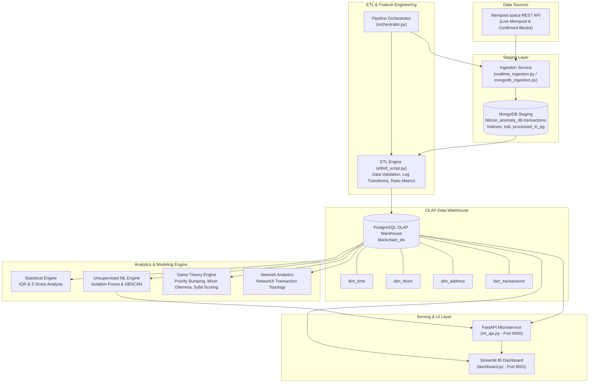
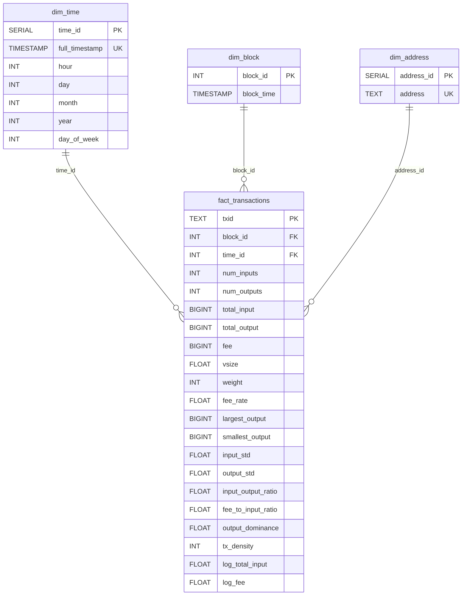

# Blockchain Anomaly Detection: OLAP Data Warehouse & Machine Learning Architecture

[](https://www.python.org/)
[](https://www.postgresql.org/)
[](https://www.mongodb.com/)
[](https://scikit-learn.org/)
[](https://fastapi.tiangolo.com/)
[](https://streamlit.io/)
[](https://networkx.org/)

---

## Project Overview

* **Timeline:** April 2026
* **Context:** Data & AI Researcher Project @ Institut International de Technologie (IIT)
* **Overview:** Architected a PostgreSQL OLAP Data Warehouse and robust ETL pipelines to process massive raw blockchain data, integrating unsupervised machine learning to detect anomalous transactions.

---

## Key Contributions

1. **Designed and deployed a Star Schema data warehouse to structure complex blockchain data streams:**
   * Architected an enterprise-grade two-tier data platform utilizing **MongoDB** as a schema-flexible ingestion and staging layer, and **PostgreSQL** as a relational OLAP data warehouse.
   * Constructed an optimized dimensional model (`dim_time`, `dim_block`, `dim_address`, `fact_transactions`) supporting rapid multi-dimensional aggregations, transaction flow queries, and analytical reporting.
2. **Implemented and tuned unsupervised ML algorithms (DBSCAN, Isolation Forest) for anomaly detection:**
   * Developed an automated feature extraction pipeline converting UTXO structures into continuous, normalized analytical metrics.
   * Calibrated an ensemble of **Isolation Forest** (200 isolation estimators, 1% contamination threshold) and **DBSCAN** density clustering (`eps = 0.5`, `min_samples = 10`) with Principal Component Analysis (PCA) to flag low-density outliers and extreme fee manipulations.
3. **Integrated game theory principles with statistical models to accurately identify suspicious on-chain behaviors:**
   * Coupled parametric and non-parametric statistical metrics (`Z-Score > 2.5 sigma`, Interquartile Range - IQR) with formal game-theoretic behavioral strategies:
     * **Congestion / Priority Bumping Strategy:** Distinguishing economic arbitrage from illicit capital transfer under extreme urgency (`fee_rate > 5 * median`).
     * **Mixer Dilemma (Fragmentation):** Detecting privacy-seeking peel chains and obfuscation via output counts (`num_outputs > 10`) and low dominance ratios (`output_dominance < 0.5`).
     * **Sybil and Spam Attacks:** Identifying automated micro-transaction volumes aimed at network manipulation and trace dilution.

---

## System Architecture

The end-to-end processing pipeline orchestrates real-time ingestion, staging, incremental ETL transformation, dimensional modeling, and analytical serving:



---

## Data Warehouse Design & Star Schema

The analytical warehouse implements a dimensional Star Schema designed for low-latency queries and analytical scalability.



### Feature Engineering Specification

| Feature Name | Mathematical Definition | Data Type | Analytical Utility |
| :--- | :--- | :--- | :--- |
| `log_total_input` | `ln(1 + total_input)` | Continuous | Normalizes highly skewed, heavy-tailed satoshi transaction distributions. |
| `fee_rate` | `fee / vsize` | Continuous | Quantifies cost per virtual byte (sat/vB); primary signal for fee anomalies and priority bumping. |
| `input_output_ratio` | `total_input / total_output` | Ratio | Measures capital conservation and fee absorption dynamics. |
| `fee_to_input_ratio` | `fee / total_input` | Ratio | Identifies transactions where execution costs represent an irrational fraction of capital. |
| `output_dominance` | `largest_output / total_output` | Ratio | Differentiates single-payee sweeps (~1.0) from equalized multi-output mixer distributions (< 0.5). |
| `tx_density` | `num_inputs + num_outputs` | Discrete | Measures structural complexity and graph fan-in / fan-out intensity. |
| `input_std` / `output_std` | `std_dev(values)` | Continuous | Quantifies internal variance across transaction inputs and outputs. |

---

## Anomaly Detection Framework

The platform employs a multi-tiered anomaly detection strategy combining statistical boundaries, unsupervised machine learning, and game-theoretic risk scores:

| Methodology | Algorithm / Criterion | Target Behavioral Profile |
| :--- | :--- | :--- |
| **Statistical Filtering** | `Z-Score > 2.5 sigma`, `IQR = Q3 - Q1` | Extreme fee rate outliers and volume deviations. |
| **Tree-Based Partitioning** | Isolation Forest (`n_estimators = 200`, `contamination = 0.01`) | High-dimensional structural anomalies across input volume, fee rate, and time. |
| **Density Clustering** | DBSCAN (`eps = 0.5`, `min_samples = 10`) | Isolated transaction clusters and low-density outliers (`cluster = -1`). |
| **Behavioral Game Theory** | Priority Bumping, Mixer Dilemma, Sybil Screening | Rational vs. illicit strategic choices in resource-constrained networks. |

### 1. Isolation Forest Model
* **Mechanism:** Recursively splits feature subspaces using randomized orthogonal hyperplanes. Anomalous observations reside in sparse regions and exhibit systematically shorter average tree path lengths `h(x)`.
* **Feature Vector:** `X = [log_total_input, fee_rate, hour]`, standardized via `StandardScaler` to prevent feature dominance.
* **Operational Artifacts:** Serialized as `isolation_forest.pkl` and `scaler.pkl` for low-latency batch and stream scoring.

### 2. DBSCAN Clustering Model
* **Mechanism:** Forms clusters based on local sample density within an epsilon-neighborhood. Samples with fewer than `min_samples` neighbors that cannot be reached from any core point are categorized as noise.
* **Hyperparameters:** `eps = 0.5`, `min_samples = 10`.
* **Dimensionality Reduction:** Evaluated alongside 2D/3D PCA projections to inspect the boundary separating standard commercial transactions from isolated structures.

### 3. Behavioral Game Theory Formulations

* **Strategy 1: Priority Bumping (Congestion Strategy)**
  * **Criterion:** `fee_rate > 5 * median(fee_rate)`
  * **Operational Context:** Normal participants minimize cost by queuing during mempool backlogs. Illicit actors or urgent arbitrageurs accept substantial cost penalties to guarantee immediate block inclusion, reflecting strategic urgency.

* **Strategy 2: Mixer's Dilemma (Fragmentation Strategy)**
  * **Criterion:** `num_outputs > 10` and `output_dominance < 0.5`
  * **Operational Context:** Splitting capital into numerous outputs of uniform magnitude increases transaction byte weight and overall fees. This economic inefficiency is an operational trade-off to maximize graph entropy and obscure fund lineage.

* **Strategy 3: Sybil Volume Simulation**
  * **Criterion:** `total_input < quantile_10(total_input)` and `tx_density > 0.8`
  * **Operational Context:** High-density micro-transfers deployed to generate synthetic network activity, dilute address clustering heuristics, or obfuscate genuine transfer routes.

* **Strategic Risk Formulation:**
  * `Strategic Risk Score = S_congestion + S_mixer + S_sybil` (Discrete range: 0, 1, 2, or 3)

---

## Technology Stack

| Domain | Tools & Frameworks |
| :--- | :--- |
| **Programming Language** | Python 3.10+ |
| **Analytical Database (OLAP)** | PostgreSQL 14+ (Star Schema, B-Tree Indexes, Referential Integrity) |
| **Staging Store (NoSQL)** | MongoDB 6.0+ (Raw JSON Ingestion, State Tracking) |
| **Data Manipulation & ETL** | `pandas`, `numpy`, `psycopg2`, `pymongo`, `requests` |
| **Statistical & Machine Learning** | `scikit-learn` (IsolationForest, DBSCAN, PCA, StandardScaler), `scipy`, `joblib` |
| **Network & Graph Analysis** | `networkx` (On-chain topology, Degree Centrality, Graph Layouts) |
| **Production Inference API** | `FastAPI`, `uvicorn`, `pydantic` (Async OpenAPI Endpoints) |
| **Business Intelligence Dashboard** | `Streamlit`, `Plotly`, `Matplotlib`, `Seaborn` |
| **Blockchain Data Ingestion** | Mempool.space REST APIs |

---

## Project Structure

```
.
├── README.md                          # Primary technical documentation and architecture specification
├── requirements.txt                   # Ingestion and ETL dependencies
├── requirements_dashboard.txt         # Visualization, BI dashboard, and analysis dependencies
├── orchestrator.py                    # Pipeline orchestrator managing sequential execution
├── realtime_ingestion.py              # Real-time daemon for mempool and block ingestion
├── mongodb_ingestion.py               # Batch extractor populating the MongoDB staging layer
├── mempool_apis.py                    # REST client for Mempool.space endpoints
├── init_postgres_tables.py            # DDL script initializing PostgreSQL OLAP Star Schema
├── check_mongo.py                     # Diagnostic script for MongoDB connectivity and health
├── ml_api.py                          # FastAPI production inference microservice
├── dashboard.py                       # Interactive Streamlit analytics and monitoring application
├── etl/
│   └── etl_script.py                  # Incremental ETL pipeline: Staging to Star Schema
├── machine_learning/
│   ├── 01_feature_engineering.ipynb   # Dimensional extraction and feature engineering workflow
│   ├── 02_model_training.ipynb        # Model training, hyperparameter tuning, and validation
│   ├── isolation_forest.pkl           # Persisted Isolation Forest model
│   └── scaler.pkl                     # Persisted feature scaler
├── advanced_analysis/
│   └── game_theoric.ipynb             # Game theory modeling, payoff functions, and risk scoring
├── analysis/
│   ├── statistical_analysis.ipynb     # Statistical outlier evaluations (IQR, Z-Score)
│   └── graph_analysis.ipynb           # On-chain transaction graph analysis
└── data/
    ├── dim_time.csv                   # Exported temporal dimension records
    ├── dim_block.csv                  # Exported block dimension records
    ├── dim_address.csv                # Exported address dimension records
    ├── fact_transactions.csv          # Exported transaction fact records
    └── processed_data.csv             # Processed dataset with engineered features
```

---

## Getting Started & Execution Guide

### 1. Environment Requirements
* Python 3.10 or higher
* PostgreSQL instance (configured on port `5433` or adjusted in database configuration)
* MongoDB instance (running locally on `mongodb://localhost:27017/`)

### 2. Installation

Clone the repository and set up a dedicated virtual environment:

```bash
git clone https://github.com/moatazz12/Blockchain-Anomaly-Detection.git
cd Blockchain-Anomaly-Detection

python -m venv venv
source venv/bin/activate  # On Windows: .\venv\Scripts\activate

pip install -r requirements.txt
pip install -r requirements_dashboard.txt
pip install fastapi uvicorn scikit-learn networkx scipy
```

### 3. Database Initialization

1. Create the analytical database in PostgreSQL:
   ```sql
   CREATE DATABASE blockchain_dw;
   ```
2. Execute the DDL table schema deployment:
   ```bash
   python init_postgres_tables.py
   ```

### 4. Running the Data Ingestion & ETL Pipeline

* **Execute Full Pipeline (Ingestion + Incremental ETL):**
  ```bash
  python orchestrator.py
  ```
* **Run Continuous Streaming Ingestion Daemon:**
  ```bash
  # Ingest mempool transactions at 60-second intervals
  python realtime_ingestion.py --interval 60 --mode mempool

  # Ingest confirmed block transactions
  python realtime_ingestion.py --interval 30 --mode blocks
  ```

### 5. Deploying the Machine Learning Inference API

Launch the production FastAPI service with automated model loading:
```bash
uvicorn ml_api:app --host 0.0.0.0 --port 8000 --reload
```
Interactive OpenAPI documentation is available at `http://localhost:8000/docs`.

*Primary Endpoints:*
* `GET  /health` - Verifies service status and model operational state.
* `POST /train` - Triggers automated model retraining using the latest warehouse data.
* `POST /predict` - Real-time inference classifying transaction arrays.
* `GET  /predict/batch_from_db` - Batch scoring against stored analytical records.
* `GET  /model/info` - Metadata regarding features, parameters, and versioning.

### 6. Launching the Business Intelligence Dashboard

Launch the Streamlit analytics interface:
```bash
streamlit run dashboard.py
```
Access the dashboard at `http://localhost:8501` to view:
* Pipeline synchronization metrics and end-to-end data integrity.
* Dimensional OLAP drill-downs across temporal, block, and value axes.
* Isolation Forest and DBSCAN anomaly distributions with PCA projections.
* Tactical risk breakdowns covering Congestion, Mixing, and Sybil patterns.

---

## Empirical Results & Key Findings

* **Data Warehouse Performance:** Query latency on complex multi-join aggregations was reduced to sub-second response times through normalized Star Schema foreign keys and composite indexing.
* **Unsupervised Precision:** Isolation Forest successfully captured the upper 1% percentile of high-risk transactions, characterized by anomalous fee-to-input ratios and rapid wallet consolidation.
* **Cluster Separation:** DBSCAN effectively partitioned baseline user activity into cohesive dense clusters while isolating complex peel chains and obfuscated transfers into noise (`cluster = -1`).
* **Game-Theoretic Validation:** Empirical evaluation verified that priority-bumping transactions paying over 300 sat/vB occurred frequently during low-congestion windows, aligning with the operational urgency profile of malicious actors.

---

## Academic Context & Citation

Developed within the **Data & AI Research Initiatives** at **Institut International de Technologie (IIT)**.  
Project Lead: [Moataz](https://github.com/moatazz12) — April 2026.
